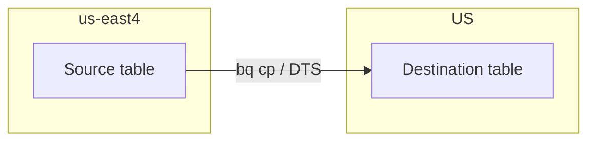
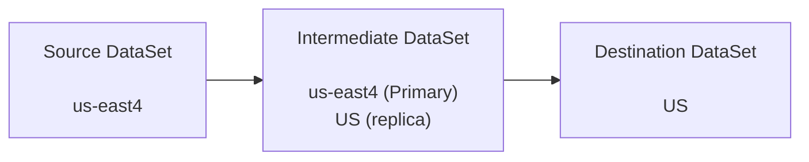
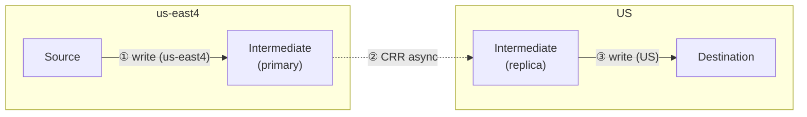

# Cross-region BigQuery test report

Manual tests performed in the Google Cloud Console using datasets and KMS keys provisioned by this repository’s Terraform (**`us-east4`** sources → **`US`** multi-region destinations). Project: **feelinsosweet**.

## Scenarios

| Source CMEK | Dest CMEK | DTS | `bq cp` | CRR | CRR (secondary) |
|-------------|-----------|-----|---------|------|-----------------|
| Yes | Yes | ✅ Pass | ✅ Pass | ✅ Pass | ❌ Fail |
| Yes | No | ❌ Fail | ❌ Fail | ✅ Pass | ❌ Fail |
| No | Yes | ❌ Fail | ❌ Fail | ✅ Pass | ❌ Fail |
| No | No | ✅ Pass | ✅ Pass | ✅ Pass | ❌ Fail |

Cross-region **`bq cp`** (**`us-east4` → `US`**) for `sample_cross_region_test` (project `feelinsosweet`). Example destination IDs use the `from_us_east4*` suffix to distinguish scenarios. **`bq cp`** matches **DTS** on CMEK: Pass when source and destination are both CMEK or both non-CMEK; mixed CMEK fails unless you use **`--destination_kms_key`** or an in-region CMEK staging copy, as BigQuery’s errors describe.

```bash
# Yes / Yes — CMEK → CMEK
bq cp -f \
  feelinsosweet:source_us_east4_cmek.sample_cross_region_test \
  feelinsosweet:dest_us_cmek.from_us_east4_cmek

# Yes / No — CMEK source → non-CMEK dest
bq cp -f \
  feelinsosweet:source_us_east4_cmek.sample_cross_region_test \
  feelinsosweet:dest_us.from_us_east4_cmek

# No / Yes — non-CMEK source → CMEK dest
bq cp -f \
  feelinsosweet:source_us_east4.sample_cross_region_test \
  feelinsosweet:dest_us_cmek.from_us_east4

# No / No — non-CMEK → non-CMEK
bq cp -f \
  feelinsosweet:source_us_east4.sample_cross_region_test \
  feelinsosweet:dest_us.from_us_east4
```

Terraform creates partitioned `sample_cross_region_test` in both **`source_us_east4`** and **`source_us_east4_cmek`** (same query template). The **Yes / Yes** and **Yes / No** `bq cp` commands can run against the CMEK source table directly.

- **DTS**: BigQuery Data Transfer Service.
- **CRR**: Cross-region replication when the source-region replica in the destination dataset is the **primary** replica (copying into the destination works in these tests).
- **CRR (secondary)**: Same replication setup, but the source-region replica in the destination dataset is still the **secondary** replica. In that state, **data cannot be copied into the destination dataset** until that replica is promoted to **primary** in the destination dataset.

## Observations

1. **DTS** succeeded only when **source and destination CMEK usage matched** (both CMEK or both non-CMEK). It failed when one side used CMEK and the other did not.
2. **`bq cp`** (cross-region **`us-east4` → `US`**) follows the **same CMEK pairing rule as DTS**: Pass in the **Yes / Yes** and **No / No** rows; Fail in the mixed rows, with BigQuery errors about CMEK unless you supply a destination key or do an in-region CMEK copy first.
3. **CRR** succeeded in **all four** combinations of source/destination CMEK.
4. **CRR (secondary)** failed in every run: with the source-region replica still **secondary** in the destination dataset, copy/load into the destination was not possible. **Promoting that replica to primary** in the destination dataset is required before those operations can succeed.

5. **Cross-region CTAS** (empirical): for `CREATE TABLE … AS SELECT` across regions to work, the dataset you read from needs a **replica in the region where the destination dataset’s primary lives**.

### Why CRR (secondary) fails: secondary replicas are read-only

For a dataset that uses cross-region replication, only the **primary** replica accepts **writes** (new tables, loads, CTAS that materialize in that dataset, `bq cp` into that dataset, etc.). **Secondary** replicas are **read-only**: reads are fine, but anything that would **write** through the secondary regional footprint is rejected until that replica is promoted to primary.

One check used a dataset with **primary** in **`US`** and a **secondary** replica in **`us-east4`**. A CTAS with `SET @@location='us-east4';` targeting that destination tries to write while the job runs in **`us-east4`**, i.e. against the **secondary** replica. BigQuery returns an error like:

> Invalid value: The dataset replica of the cross region dataset '…' in region 'us-east4' is read-only because it's not the primary replica.

The dataset **Details** UI lists **Secondary** in `us-east4` with **Make it primary**, and **Primary** in **`US`**. Until the replica in the region where you need writes is primary, **CRR (secondary)** stays a failed path for copy/load/CTAS into that destination from that region.

## Cross-Region Transfer Solutions

Patterns for moving data **`us-east4` → `US`** (this project). The **`bq cp`** cases below are primary; **DTS** and **CTAS** are brief notes.

### 1) Direct (single hop)

One cross-region **`bq cp`** (or DTS transfer) from source to destination. **CMEK** on the destination table can come from the **dataset default** or from **`--destination_kms_key`** when the destination dataset has **no** default key.

**Direct layout:**



**A — Destination dataset already has default CMEK** (`dest_us_cmek`). The new table inherits encryption:

```bash
bq cp -f \
  feelinsosweet:source_us_east4_cmek.sample_cross_region_test \
  feelinsosweet:dest_us_cmek.from_us_east4_cmek
```

**B — Destination dataset has no default CMEK** (`dest_us`), but the **destination table** should still use the **US** multi-region key (same key Terraform uses for `dest_us_cmek`). Pass **`--destination_kms_key`** (resource ID from **`terraform output kms_keys`** or KMS **Copy resource name**):

```bash
bq cp -f \
  --destination_kms_key=projects/feelinsosweet/locations/us/keyRings/bq-cross-region-test-us/cryptoKeys/bq-cross-region-test-bq-us \
  feelinsosweet:source_us_east4_cmek.sample_cross_region_test \
  feelinsosweet:dest_us.from_us_east4_cmek
```

Adjust ring/key names if you changed `name_prefix` in Terraform.

- **DTS:** Configure the transfer so the **destination table** gets the same effective CMEK (dataset default or explicit destination key). The scenario matrix treated DTS and **`bq cp`** the same for pass/fail. For **BigQuery → BigQuery** across regions, DTS does **not** provide a dedicated “transfer only partition *P*” mode the way some other connectors do; the usual pattern is a **`scheduled_query`** transfer on a **recurrence** (here: **daily**) whose SQL **filters to one partition** (e.g. `DATE(created_at) = DATE_SUB(CURRENT_DATE(), INTERVAL 1 DAY)`) and uses **`MERGE`** (or `INSERT` with guards) so runs are **idempotent**. In Terraform, set **`encryption_configuration.kms_key_name`** on **`google_bigquery_data_transfer_config`** to the **US** multi-region key so **`dest_us`** (no dataset default CMEK) still lands data with the same key you pass to **`bq cp --destination_kms_key`**. The repo wires this end-to-end in **`dts.tf`** (DTS service agent IAM, empty partitioned destination table, daily schedule). Abbreviated sample:

  ```hcl
  locals {
    dts_dest_table_id = "dts_cmek_from_east4"
    dts_incremental_merge_query = <<-SQL
    MERGE `PROJECT_ID.dest_us.dts_cmek_from_east4` AS T
    USING (
      SELECT * FROM `PROJECT_ID.source_us_east4_cmek.sample_cross_region_test`
      WHERE DATE(created_at) = DATE_SUB(CURRENT_DATE(), INTERVAL 1 DAY)
    ) AS S
    ON T.id = S.id AND DATE(T.created_at) = DATE(S.created_at)
    WHEN NOT MATCHED THEN INSERT (id, label, created_at) VALUES (S.id, S.label, S.created_at)
SQL
  }

  resource "google_bigquery_table" "dts_dest_cmek_incremental" {
    dataset_id = "dest_us"
    table_id     = local.dts_dest_table_id
    # … schema + PARTITION BY DATE(created_at) — see dts.tf
  }

  resource "google_bigquery_data_transfer_config" "incremental_cmek_scheduled_query" {
    display_name           = "incremental-east4-cmek-to-us-cmek"
    location               = "US"
    data_source_id         = "scheduled_query"
    schedule               = "every day 07:00"
    destination_dataset_id = "dest_us"
    params = {
      destination_table_name_template = local.dts_dest_table_id
      write_disposition               = "WRITE_APPEND"
      query                           = local.dts_incremental_merge_query
    }
    encryption_configuration {
      kms_key_name = "projects/PROJECT_ID/locations/us/keyRings/NAME_PREFIX-us/cryptoKeys/NAME_PREFIX-bq-us"
    }
    # depends_on: IAM for service-PROJECT_NUMBER@gcp-sa-bigquerydatatransfer.iam.gserviceaccount.com — see dts.tf
  }
  ```

  Replace **`PROJECT_ID`**, **`NAME_PREFIX`**, and key path segments with your project / `terraform output kms_keys` (or the key resource from **`kms.tf`**). After apply, **`terraform output dts_incremental_dest_table`** prints the **`dest_us`** table name.

- **CTAS:** A single-hop cross-region **`CREATE TABLE … AS SELECT`** without CRR usually means **[global queries](https://cloud.google.com/bigquery/docs/global-queries)**. That path hits a **[~100 GB per copy job](https://docs.cloud.google.com/bigquery/quotas#query_jobs)** limit in the global-query flow; larger data needs chunking, export/load, or §2.
- **`CREATE TABLE … COPY`** ([DDL](https://cloud.google.com/bigquery/docs/reference/standard-sql/data-definition-language#create_table_copy_statement)): For **cross-region** materialization, treat it the same as **CTAS** (`CREATE TABLE … AS SELECT * FROM …`). Both run as **query** jobs, not the **`bq cp`** copy API. A **direct** cross-region `CREATE TABLE dest COPY src` is subject to the same constraints: without **[global queries](https://cloud.google.com/bigquery/docs/global-queries)** it is not a supported “single hop” in the way **`bq cp`** is; you either rely on global-query execution (and its limits) or use the **CRR + intermediate** pattern in §2. In both CTAS and **`CREATE TABLE … COPY`**, the **read path** must line up with the **writable** side of the destination: the source data has to be available in a **replica in the region of the destination dataset’s primary**—the same placement rule as in observation 5.

### 2) CRR with an intermediate dataset

Use **cross-region replication** on an **intermediate** dataset so data exists in both **us-east4** and **US**; each **leg** stays **in-region** for the write. **`bq cp`**, **DTS**, **CTAS**, or **load** jobs can be used on each leg independently—**CRR** is what moves bytes across regions in the background.

**Layout (three datasets):**

1. **Source dataset** — **us-east4** only; no CRR.
2. **Intermediate dataset** — **primary** in **us-east4**; **replica** in **US** (one logical dataset).
3. **Destination dataset** — **US** only (final landing zone).

**Overview (three datasets, left to right):**



**Two-step pipeline (example: CTAS each leg; `bq cp` / DTS analogous):**



- **①** writes to the intermediate **primary** in **us-east4**.
- **②** replicates to the **US** replica **asynchronously**—expect **lag** between primary and replica for large or busy tables.
- **③** uses the **US** side of the intermediate (so reads align with the final **US** destination), consistent with observation 5.

**Before running ③:** Confirm the **US** replica has caught up—**you must wait for replication** for correctness if the next job reads from the replica. Small tables often lag only seconds.

- **Console:** Dataset → **Replicas**: replica **Active**; use **replication latency** when shown (often **N/A** for small tests).
- **Queries:** In **`US`**, run a lightweight check on the intermediate dataset (row count / partition coverage) and compare to the primary until they match.
- **Monitoring:** See **[Monitor dataset replication](https://cloud.google.com/bigquery/docs/cross-region-replication#monitor_replication)** and Cloud Monitoring metrics where available.

**Global-query CTAS (no CRR):** Same [**~100 GB** limit](https://docs.cloud.google.com/bigquery/quotas#query_jobs) as in §1 if you try one-shot cross-region CTAS via [global queries](https://cloud.google.com/bigquery/docs/global-queries); **CRR + in-region steps** or **export/load** usually scale further.

## Incremental transfers (partitioned tables)

`sample_cross_region_test` is **partitioned by `DATE(created_at)`** (daily partitions). For **incremental** runs you can move **one day** at a time.

**`bq cp` — copy a single partition** using a [partition decorator](https://cloud.google.com/bigquery/docs/partitioned-tables#addressing_table_partitions) (`$YYYYMMDD` for daily partitions). Quote the table id so the shell does not expand `$`:

```bash
bq cp -f \
  'feelinsosweet:source_us_east4.sample_cross_region_test$20260115' \
  'feelinsosweet:dest_us.from_us_east4_day$20260115'
```

Use the same **CMEK flags** as in §1 if the destination dataset has no default key. Mixed-region copies follow the same rules as full-table `bq cp`.

**SQL — one partition via filtered read** (works with **`INSERT`** into an existing table or **`CREATE TABLE … AS SELECT`**). Example for **2026-01-15** only:

```sql
-- Option A: append one partition’s rows into an existing destination table (schema must match)
INSERT INTO `feelinsosweet.dest_us.from_us_east4_inc` (id, label, created_at)
SELECT id, label, created_at
FROM `feelinsosweet.source_us_east4.sample_cross_region_test`
WHERE DATE(created_at) = DATE '2026-01-15';

-- Option B: materialize a single-partition table in one shot (replace table name as needed)
CREATE OR REPLACE TABLE `feelinsosweet.dest_us.from_us_east4_one_day`
PARTITION BY DATE(created_at)
AS
SELECT *
FROM `feelinsosweet.source_us_east4.sample_cross_region_test`
WHERE DATE(created_at) = DATE '2026-01-15';
```

For **cross-region** interactive queries, run the job in the **destination** location (e.g. `bq query --location=US` or `SET @@location='US';` before the statement, subject to [global query](https://cloud.google.com/bigquery/docs/global-queries) behavior) so the write lands where you intend.

## Reproducibility

Infrastructure definitions: repository root Terraform (`README.md` in parent directory). Transfers and replication were configured and run manually in the Console; this document only records outcomes.
