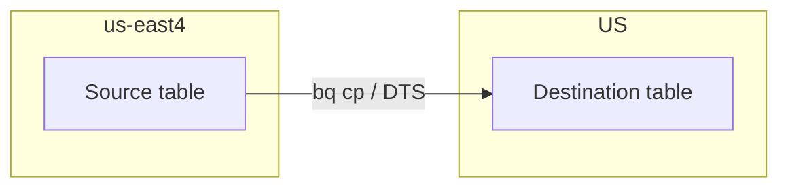
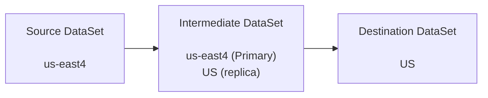
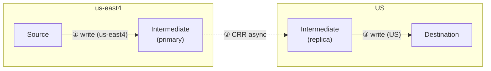

# Cross-region BigQuery test report

Manual tests performed in the Google Cloud Console using datasets and KMS keys provisioned by this repository’s Terraform (**`us-east4`** sources → **`US`** multi-region destinations). Project: **feelinsosweet**.

## Scenarios

| Source CMEK | Dest CMEK | DTS | `bq cp` | CRR | CRR (secondary) |
|-------------|-----------|-----|---------|------|-----------------|
| Yes | Yes | ✅ Pass | ✅ Pass | ✅ Pass | ❌ Fail |
| Yes | No | ❌ Fail | ❌ Fail | ✅ Pass | ❌ Fail |
| No | Yes | ❌ Fail | ❌ Fail | ✅ Pass | ❌ Fail |
| No | No | ✅ Pass | ✅ Pass | ✅ Pass | ❌ Fail |

Cross-region **`bq cp`** (**`us-east4` → `US`**) for `sample_cross_region_test` (project `feelinsosweet`). Example destination IDs use the `from_us_east4*` suffix to distinguish scenarios. **`bq cp`** matches **DTS** on CMEK: Pass when source and destination are both CMEK or both non-CMEK; mixed CMEK fails unless you use **`--destination_kms_key`** or an in-region CMEK staging copy, as BigQuery’s errors describe.

```bash
# Yes / Yes — CMEK → CMEK
bq cp -f \
  feelinsosweet:source_us_east4_cmek.sample_cross_region_test \
  feelinsosweet:dest_us_cmek.from_us_east4_cmek

# Yes / No — CMEK source → non-CMEK dest
bq cp -f \
  feelinsosweet:source_us_east4_cmek.sample_cross_region_test \
  feelinsosweet:dest_us.from_us_east4_cmek

# No / Yes — non-CMEK source → CMEK dest
bq cp -f \
  feelinsosweet:source_us_east4.sample_cross_region_test \
  feelinsosweet:dest_us_cmek.from_us_east4

# No / No — non-CMEK → non-CMEK
bq cp -f \
  feelinsosweet:source_us_east4.sample_cross_region_test \
  feelinsosweet:dest_us.from_us_east4
```

Terraform creates partitioned `sample_cross_region_test` in both **`source_us_east4`** and **`source_us_east4_cmek`** (same query template). The **Yes / Yes** and **Yes / No** `bq cp` commands can run against the CMEK source table directly.

- **DTS**: BigQuery Data Transfer Service.
- **CRR**: Cross-region replication when the source-region replica in the destination dataset is the **primary** replica (copying into the destination works in these tests).
- **CRR (secondary)**: Same replication setup, but the source-region replica in the destination dataset is still the **secondary** replica. In that state, **data cannot be copied into the destination dataset** until that replica is promoted to **primary** in the destination dataset.

## Observations

1. **DTS** succeeded only when **source and destination CMEK usage matched** (both CMEK or both non-CMEK). It failed when one side used CMEK and the other did not.
2. **`bq cp`** (cross-region **`us-east4` → `US`**) follows the **same CMEK pairing rule as DTS**: Pass in the **Yes / Yes** and **No / No** rows; Fail in the mixed rows, with BigQuery errors about CMEK unless you supply a destination key or do an in-region CMEK copy first.
3. **CRR** succeeded in **all four** combinations of source/destination CMEK.
4. **CRR (secondary)** failed in every run: with the source-region replica still **secondary** in the destination dataset, copy/load into the destination was not possible. **Promoting that replica to primary** in the destination dataset is required before those operations can succeed.

5. **Cross-region CTAS** (empirical): for `CREATE TABLE … AS SELECT` across regions to work, the dataset you read from needs a **replica in the region where the destination dataset’s primary lives**.

6. **DTS `scheduled_query` is not cross-region** (empirical + documented): the scheduled_query TransferConfig's `location` is forced to equal the **destination dataset's** location, and the query job runs there. Reading a table from a different region fails with an **access-denied/table-not-found** error, and trying to move the transfer to the source region fails at **create time**. The only `google_bigquery_data_transfer_config` `data_source_id` that actually performs cross-region copies is **`cross_region_copy`** (full-dataset, not query-driven). See the dedicated finding in §1 below.

7. **DTS `cross_region_copy` has no partition-level incremental either** (documented): its params are `source_project_id` / `source_dataset_id` / `overwrite_destination_table` only — no partition filter, no `@run_date`. Each run either **skips** an unchanged source table or **truncates and replaces** the destination table whole. Per-partition / `MERGE`-style incremental across regions requires the §2 CRR + intermediate pattern (so each leg is in-region and can use `scheduled_query` / `MERGE`). Citations and trade-offs in the dedicated finding under §1.

### Why CRR (secondary) fails: secondary replicas are read-only

For a dataset that uses cross-region replication, only the **primary** replica accepts **writes** (new tables, loads, CTAS that materialize in that dataset, `bq cp` into that dataset, etc.). **Secondary** replicas are **read-only**: reads are fine, but anything that would **write** through the secondary regional footprint is rejected until that replica is promoted to primary.

One check used a dataset with **primary** in **`US`** and a **secondary** replica in **`us-east4`**. A CTAS with `SET @@location='us-east4';` targeting that destination tries to write while the job runs in **`us-east4`**, i.e. against the **secondary** replica. BigQuery returns an error like:

> Invalid value: The dataset replica of the cross region dataset '…' in region 'us-east4' is read-only because it's not the primary replica.

The dataset **Details** UI lists **Secondary** in `us-east4` with **Make it primary**, and **Primary** in **`US`**. Until the replica in the region where you need writes is primary, **CRR (secondary)** stays a failed path for copy/load/CTAS into that destination from that region.

## Cross-Region Transfer Solutions

Patterns for moving data **`us-east4` → `US`** (this project). The **`bq cp`** cases below are primary; **DTS** and **CTAS** are brief notes.

### 1) Direct (single hop)

One cross-region **`bq cp`** (or DTS transfer) from source to destination. **CMEK** on the destination table can come from the **dataset default** or from **`--destination_kms_key`** when the destination dataset has **no** default key.

**Direct layout:**



**A — Destination dataset already has default CMEK** (`dest_us_cmek`). The new table inherits encryption:

```bash
bq cp -f \
  feelinsosweet:source_us_east4_cmek.sample_cross_region_test \
  feelinsosweet:dest_us_cmek.from_us_east4_cmek
```

**B — Destination dataset has no default CMEK** (`dest_us`), but the **destination table** should still use the **US** multi-region key (same key Terraform uses for `dest_us_cmek`). Pass **`--destination_kms_key`** (resource ID from **`terraform output kms_keys`** or KMS **Copy resource name**):

```bash
bq cp -f \
  --destination_kms_key=projects/feelinsosweet/locations/us/keyRings/bq-cross-region-test-us/cryptoKeys/bq-cross-region-test-bq-us \
  feelinsosweet:source_us_east4_cmek.sample_cross_region_test \
  feelinsosweet:dest_us.from_us_east4_cmek
```

Adjust ring/key names if you changed `name_prefix` in Terraform.

- **DTS (cross-region):** the only cross-region–capable DTS data source is **`cross_region_copy`** (full-dataset copy). The per-query **`scheduled_query`** data source **does not** support cross-region reads — see the dedicated finding just below this bullet. The `scheduled_query` sample further down this bullet is included for reference (repo wires it end-to-end in **`dts.tf`**) but **will fail at run time** against a cross-region source; it's only useful in-region, or as the second leg of the §2 CRR + intermediate pattern. The scenario matrix at the top of this document treated DTS and **`bq cp`** the same for pass/fail because the matrix runs were all done via **`cross_region_copy`**-style transfers, not `scheduled_query`.

  For incremental / per-partition semantics you normally want `scheduled_query`: a **daily** run whose SQL filters to one partition (e.g. `DATE(created_at) = DATE_SUB(CURRENT_DATE(), INTERVAL 1 DAY)`) and uses **`MERGE`** (or `INSERT` with guards) so runs are **idempotent**. That pattern works **in-region** (and works cross-region only when you combine it with §2's CRR intermediate dataset, where each leg is in-region). The Terraform below is what the repo wires for the `us-east4 → US` test case — it's shown so the config shape is concrete, but the finding below this bullet shows it **fails at run time** in cross-region mode:

  ```hcl
  locals {
    dts_dest_table_id = "dts_cmek_from_east4"
    dts_incremental_merge_query = <<-SQL
    MERGE `PROJECT_ID.dest_us.dts_cmek_from_east4` AS T
    USING (
      SELECT * FROM `PROJECT_ID.source_us_east4_cmek.sample_cross_region_test`
      WHERE DATE(created_at) = DATE_SUB(CURRENT_DATE(), INTERVAL 1 DAY)
    ) AS S
    ON T.id = S.id AND DATE(T.created_at) = DATE(S.created_at)
    WHEN NOT MATCHED THEN INSERT (id, label, created_at) VALUES (S.id, S.label, S.created_at)
SQL
  }

  resource "google_bigquery_table" "dts_dest_cmek_incremental" {
    dataset_id = "dest_us"
    table_id     = local.dts_dest_table_id
    # … schema + PARTITION BY DATE(created_at) — see dts.tf
  }

  resource "google_bigquery_data_transfer_config" "incremental_cmek_scheduled_query" {
    display_name           = "incremental-east4-cmek-to-us-cmek"
    location               = "US"
    data_source_id         = "scheduled_query"
    schedule               = "every day 07:00"
    destination_dataset_id = "dest_us"
    params = {
      destination_table_name_template = local.dts_dest_table_id
      write_disposition               = "WRITE_APPEND"
      query                           = local.dts_incremental_merge_query
    }
    encryption_configuration {
      kms_key_name = "projects/PROJECT_ID/locations/us/keyRings/NAME_PREFIX-us/cryptoKeys/NAME_PREFIX-bq-us"
    }
    # depends_on: IAM for service-PROJECT_NUMBER@gcp-sa-bigquerydatatransfer.iam.gserviceaccount.com — see dts.tf
  }
  ```

  Replace **`PROJECT_ID`**, **`NAME_PREFIX`**, and key path segments with your project / `terraform output kms_keys` (or the key resource from **`kms.tf`**). After apply, **`terraform output dts_incremental_dest_table`** prints the **`dest_us`** table name. DML vs DQL destination-table pre-creation, the two CMEK knobs, and the required IAM are all covered in the cross-region finding right below this bullet.

- **CTAS:** A single-hop cross-region **`CREATE TABLE … AS SELECT`** without CRR usually means **[global queries](https://cloud.google.com/bigquery/docs/global-queries)**. That path hits a **[~100 GB per copy job](https://docs.cloud.google.com/bigquery/quotas#query_jobs)** limit in the global-query flow; larger data needs chunking, export/load, or §2.
- **`CREATE TABLE … COPY`** ([DDL](https://cloud.google.com/bigquery/docs/reference/standard-sql/data-definition-language#create_table_copy_statement)): For **cross-region** materialization, treat it the same as **CTAS** (`CREATE TABLE … AS SELECT * FROM …`). Both run as **query** jobs, not the **`bq cp`** copy API. A **direct** cross-region `CREATE TABLE dest COPY src` is subject to the same constraints: without **[global queries](https://cloud.google.com/bigquery/docs/global-queries)** it is not a supported “single hop” in the way **`bq cp`** is; you either rely on global-query execution (and its limits) or use the **CRR + intermediate** pattern in §2. In both CTAS and **`CREATE TABLE … COPY`**, the **read path** must line up with the **writable** side of the destination: the source data has to be available in a **replica in the region of the destination dataset’s primary**—the same placement rule as in observation 5.

#### Finding: DTS `scheduled_query` is not cross-region capable

The repo defines four `scheduled_query` DTS configs against the same `us-east4 → US` topology as the rest of the test suite, in **`dts.tf`**:

- `incremental_cmek_scheduled_query` — recurring MERGE into a pre-created partitioned table (config-level `encryption_configuration`).
- `ondemand_select_plain` — on-demand `SELECT … WHERE DATE(created_at) = @run_date` with no CMEK knobs set.
- `ondemand_select_ec` — same, with config-level `encryption_configuration.kms_key_name` only.
- `ondemand_select_ec_cmek` — same, with `encryption_configuration` **and** the per-query `params.destination_table_kms_key`, and an attempted `location = "us-east4"` to try to run the query in the source region.

**Results**

1. All three US-located variants create successfully. Every run fails with:

    > Failed to start BigQuery job. Error: **Access Denied:** Table `feelinsosweet:source_us_east4_cmek.sample_cross_region_test`: User does not have permission to query table … or perhaps it does not exist. User: `bq-cross-region-test-dts-sq@feelinsosweet.iam.gserviceaccount.com`.

    This is not an IAM problem (the runner SA has `roles/bigquery.dataViewer` on the `us-east4` source dataset). It's the classic single-region BigQuery query planner refusing to see a table in a **different** region.

2. The variant with `location = "us-east4"` **fails at `transferConfigs.create`** before any run:

    > Error 400: **Cannot create a transfer in REGION_US_EAST_4 when destination dataset is located in JURISDICTION_US**

**Why** — documented in [Data location and transfers](https://cloud.google.com/bigquery/docs/dts-locations):

> Transfer configurations have locations. When you set up a transfer configuration, set the transfer configuration up in the same project as the destination dataset. **The location of the transfer configuration is automatically set to the same location that you specified for the destination dataset. The BigQuery Data Transfer Service processes and stages data in the same location as the destination BigQuery dataset.**

Combined with [Scheduling queries — Destination table](https://cloud.google.com/bigquery/docs/scheduling-queries#destination_table):

> The destination dataset and table for a scheduled query must be in the same project as the scheduled query.

So, for a `scheduled_query` TransferConfig: **transfer location == destination dataset location == BigQuery query processing location**. The query is a regular BigQuery query in the destination's region and inherits the same cross-region read restrictions as any hand-written `SELECT` there ([global queries](https://cloud.google.com/bigquery/docs/global-queries) excepted, with their ~100 GB per-copy-job cap).

**What to use instead for cross-region DTS**

Use the **`cross_region_copy`** `data_source_id` — that's what the four imported console-created jobs in `dts_console_imported.tf` use. It performs a **full-dataset** copy across regions, not a query. Trade-offs:

| Axis | `scheduled_query` | `cross_region_copy` |
|---|---|---|
| Cross-region | **No** (create-time / run-time failure as above) | **Yes** |
| Granularity | Any SQL — pick columns, filter partitions, `MERGE` | **Whole dataset** (all tables in the source); partition-level copy not supported — see finding below |
| CMEK on destination table | Dataset default or per-job knobs (see next section) | Dataset default on the destination dataset |
| Incremental / idempotent | Yes (via `@run_date` + `MERGE`/`WHERE`) | **No partition-level incremental**; per-table "skip-if-unchanged, otherwise truncate-and-replace" |
| Schedulable | Yes | Yes |

If you need per-partition / `MERGE` semantics **and** cross-region, the tested working combination is **§2** below — stage via CRR so each `scheduled_query` leg is in-region.

#### Finding: `cross_region_copy` has no partition-level incremental either

`cross_region_copy` solves the cross-region problem that kills `scheduled_query`, but it does it at **dataset / table** granularity — **not** partition granularity. The [Copying datasets](https://cloud.google.com/bigquery/docs/copying-datasets) doc is explicit about the semantics in its **Limitations** section:

> Appending data to a partitioned or non-partitioned table in the destination dataset isn't supported. If there are no changes in the source table, the table is skipped. If the source table is updated, the destination table is completely truncated and replaced.

> If a table exists in the source dataset and the destination dataset, and the source table has not changed since the last successful copy, it's skipped. The source table is skipped even if the **Overwrite destination tables** checkbox is selected.

> When truncating tables in the destination dataset, the dataset copy job doesn't detect any changes made to resources in the destination dataset before it begins the copy job. The dataset copy job overwrites all of the data in the destination dataset, including both the tables and schema.

The **params schema** ([API sample](https://cloud.google.com/bigquery/docs/samples/bigquerydatatransfer-copy-dataset), and the imported configs in `dts_console_imported.tf`) reflects the same reality — the only knobs are:

- `source_project_id`
- `source_dataset_id`
- `overwrite_destination_table` — boolean

There is **no partition filter, no `@run_date`, and no "copy only partition P" option**. So on each scheduled run:

- If the source table hasn't changed since the last successful copy, it's **skipped** (even with `overwrite_destination_table=true`).
- If the source table has changed in any partition, the **entire** destination table is truncated and rewritten.

That's fine as a **full-dataset / full-table** cross-region copy (what the scenario matrix at the top of this document exercises), but it's not a substitute for partitioned incremental loading. Additional hard constraints from the same doc worth being aware of when wiring this up in Terraform (`dts_console_imported.tf`):

- "Cross-region table copy job is not supported for tables encrypted with CMEK when the destination dataset is not encrypted with CMEK and there is no CMEK provided. Copying tables with default encryption across regions is supported." — matches the "mixed CMEK" failures in the top-of-doc matrix.
- "Both the source and destination tables must have the same partitioning schema."
- Not supported in BigQuery Omni regions.

**Bottom line on cross-region + incremental:**

| Requirement | Recommended path |
|---|---|
| Cross-region, **full-dataset** refresh, tolerable as overwrite-or-skip | `cross_region_copy` DTS (what `dts_console_imported.tf` wires) |
| Cross-region, **per-partition / MERGE**, idempotent | **§2 below** — CRR intermediate dataset, then `scheduled_query` (or `bq cp`) **in-region** on each leg |
| Cross-region, **ongoing async replication** at dataset level | Cross-region dataset replication (`ALTER SCHEMA ADD REPLICA …`) — observation 5 + §2 already lean on this |
| Cross-region, **single-hop SQL** (CTAS) | [Global queries](https://cloud.google.com/bigquery/docs/global-queries), subject to the ~100 GB per-copy-job cap |

#### CMEK on a `scheduled_query` TransferConfig: two different knobs

`scheduled_query` exposes two CMEK settings that are often confused — `dts.tf` carries a variant for each:

1. **TransferConfig-level CMEK** — the `encryption_configuration.kms_key_name` field on `google_bigquery_data_transfer_config` (same thing as `bq mk --transfer_config --destination_kms_key`). Per [Specify encryption key with scheduled queries](https://cloud.google.com/bigquery/docs/scheduling-queries#specify_encryption_key_with_scheduled_queries):

    > When you specify a CMEK with a transfer, the BigQuery Data Transfer Service applies the CMEK to any intermediate on-disk cache of ingested data so that the entire data transfer workflow is CMEK compliant.

    Also: the DTS propagates this key to the **destination table** on each run. This setting is **sticky** — once a transfer is created without CMEK, you cannot add one later; once it has CMEK, you can only change the key.

2. **Per-query destination-table CMEK** — the `destination_table_kms_key` entry inside the scheduled_query `params` map (this is the "Destination table KMS key" advanced option in the DTS console). It only applies to the **destination table** the query writes to — it does **not** cover the intermediate cache.

You can set one, the other, or both. In `dts.tf` we carry `ondemand_select_plain` (neither), `ondemand_select_ec` (#1 only), and `ondemand_select_ec_cmek` (both) to make the different wirings inspectable — but as shown above none of them successfully **run** against the cross-region `us-east4` source, so CMEK propagation can only be observed end-to-end once you make the transfer same-region (or front it with §2 CRR).

#### Service account and IAM for `scheduled_query` (required)

Unlike `cross_region_copy`, a `scheduled_query` TransferConfig needs an explicit runtime identity. Without one the API rejects the config with *"Failed to find a valid credential. The field 'version_info' or 'service_account_name' must be specified."* The working wiring in `dts.tf`:

- User-managed runner SA (`google_service_account.dts_scheduled_query_runner`) set on the TransferConfig via `service_account_name`.
- DTS service agent `service-<PROJECT_NUMBER>@gcp-sa-bigquerydatatransfer.iam.gserviceaccount.com` needs:
  - `roles/iam.serviceAccountTokenCreator` on the project — mint tokens.
  - `roles/iam.serviceAccountUser` on the runner SA — act as it.
- Runner SA needs:
  - `roles/bigquery.jobUser` on the project — run the query job.
  - `roles/bigquery.dataViewer` on the **source** dataset.
  - `roles/bigquery.dataEditor` on the **destination** dataset.
- If you set any CMEK knob, the BigQuery **encryption** service agent (`bq-<PROJECT_NUMBER>@bigquery-encryption.iam.gserviceaccount.com`, *not* the runner SA) needs `roles/cloudkms.cryptoKeyEncrypterDecrypter` on the KMS key. In `kms.tf` / `dts.tf` this is `google_kms_crypto_key_iam_member.bq_service_agent_us_multi`.

#### Destination table existence: DML vs DQL

- **DML** (`MERGE`, `INSERT`, `UPDATE`, …): the destination table must **already exist** when the job runs — the DML references it by name. This is why `incremental_cmek_scheduled_query` in `dts.tf` pre-creates `google_bigquery_table.dts_dest_cmek_incremental` with a partition spec.
- **DQL** (`SELECT` …): you do **not** need to pre-create the destination table. Per [Scheduling queries — Destination table](https://cloud.google.com/bigquery/docs/scheduling-queries#destination_table):

    > If the destination table for your results doesn't exist when you set up the scheduled query, BigQuery attempts to create the table for you.

    With `partitioning_field` set in `params`, DTS creates a **time-unit column partitioned** destination table on the first successful run and `WRITE_APPEND`s on subsequent runs — which is why the three `ondemand_select_*` variants don't declare a `google_bigquery_table` resource.

### 2) CRR with an intermediate dataset

Use **cross-region replication** on an **intermediate** dataset so data exists in both **us-east4** and **US**; each **leg** stays **in-region** for the write. **`bq cp`**, **DTS**, **CTAS**, or **load** jobs can be used on each leg independently—**CRR** is what moves bytes across regions in the background.

**Layout (three datasets):**

1. **Source dataset** — **us-east4** only; no CRR.
2. **Intermediate dataset** — **primary** in **us-east4**; **replica** in **US** (one logical dataset).
3. **Destination dataset** — **US** only (final landing zone).

**Overview (three datasets, left to right):**



**Two-step pipeline (example: CTAS each leg; `bq cp` / DTS analogous):**



- **①** writes to the intermediate **primary** in **us-east4**.
- **②** replicates to the **US** replica **asynchronously**—expect **lag** between primary and replica for large or busy tables.
- **③** uses the **US** side of the intermediate (so reads align with the final **US** destination), consistent with observation 5.

**Before running ③:** Confirm the **US** replica has caught up—**you must wait for replication** for correctness if the next job reads from the replica. Small tables often lag only seconds.

- **Console:** Dataset → **Replicas**: replica **Active**; use **replication latency** when shown (often **N/A** for small tests).
- **Queries:** In **`US`**, run a lightweight check on the intermediate dataset (row count / partition coverage) and compare to the primary until they match.
- **Monitoring:** See **[Monitor dataset replication](https://cloud.google.com/bigquery/docs/cross-region-replication#monitor_replication)** and Cloud Monitoring metrics where available.

**Global-query CTAS (no CRR):** Same [**~100 GB** limit](https://docs.cloud.google.com/bigquery/quotas#query_jobs) as in §1 if you try one-shot cross-region CTAS via [global queries](https://cloud.google.com/bigquery/docs/global-queries); **CRR + in-region steps** or **export/load** usually scale further.

## Incremental transfers (partitioned tables)

`sample_cross_region_test` is **partitioned by `DATE(created_at)`** (daily partitions). For **incremental** runs you can move **one day** at a time.

**`bq cp` — copy a single partition** using a [partition decorator](https://cloud.google.com/bigquery/docs/partitioned-tables#addressing_table_partitions) (`$YYYYMMDD` for daily partitions). Quote the table id so the shell does not expand `$`:

```bash
bq cp -f \
  'feelinsosweet:source_us_east4.sample_cross_region_test$20260115' \
  'feelinsosweet:dest_us.from_us_east4_day$20260115'
```

Use the same **CMEK flags** as in §1 if the destination dataset has no default key. Mixed-region copies follow the same rules as full-table `bq cp`.

**SQL — one partition via filtered read** (works with **`INSERT`** into an existing table or **`CREATE TABLE … AS SELECT`**). Example for **2026-01-15** only:

```sql
-- Option A: append one partition’s rows into an existing destination table (schema must match)
INSERT INTO `feelinsosweet.dest_us.from_us_east4_inc` (id, label, created_at)
SELECT id, label, created_at
FROM `feelinsosweet.source_us_east4.sample_cross_region_test`
WHERE DATE(created_at) = DATE '2026-01-15';

-- Option B: materialize a single-partition table in one shot (replace table name as needed)
CREATE OR REPLACE TABLE `feelinsosweet.dest_us.from_us_east4_one_day`
PARTITION BY DATE(created_at)
AS
SELECT *
FROM `feelinsosweet.source_us_east4.sample_cross_region_test`
WHERE DATE(created_at) = DATE '2026-01-15';
```

For **cross-region** interactive queries, run the job in the **destination** location (e.g. `bq query --location=US` or `SET @@location='US';` before the statement, subject to [global query](https://cloud.google.com/bigquery/docs/global-queries) behavior) so the write lands where you intend.

## Reproducibility

Infrastructure definitions: repository root Terraform (`README.md` in parent directory). Transfers and replication were configured and run manually in the Console; this document only records outcomes.

## Appendix: DTS data source schemas

The DTS config fields that confused us the most (what `params` a given `data_source_id` accepts, what's required vs optional, what `allowedValues` are, etc.) are authoritatively defined by the **[BigQuery Data Transfer Service — `projects.dataSources.list`](https://cloud.google.com/bigquery/docs/reference/datatransfer/rest/v1/projects.dataSources/list)** API. Per that reference:

> `GET https://bigquerydatatransfer.googleapis.com/v1/{parent=projects/*}/dataSources`

> `parent` (string, required) — The BigQuery project id for which data sources should be returned. Must be in the form `projects/{projectId}` or `projects/{projectId}/locations/{locationId}`.

To dump all data sources enabled in a project you can either use the API explorer on that reference page (the console dev did `parent=projects/feelinsosweet` to produce the definitions below) or call the endpoint directly:

```bash
curl -sH "Authorization: Bearer $(gcloud auth print-access-token)" \
  "https://bigquerydatatransfer.googleapis.com/v1/projects/$(gcloud config get-value project)/dataSources" \
  | jq '.dataSources[] | select(.dataSourceId=="cross_region_copy" or .dataSourceId=="scheduled_query")'
```

The two data sources this repo exercises are captured verbatim below.

### `cross_region_copy` (full-dataset copy — what `dts_console_imported.tf` uses)

```json
{
  "name": "projects/feelinsosweet/dataSources/cross_region_copy",
  "dataSourceId": "cross_region_copy",
  "displayName": "Dataset Copy",
  "description": "Dataset Copy in BigQuery.",
  "clientId": "433065040935-uvs8ptbn0udhuartdhl4nn1l27t5v3qg.apps.googleusercontent.com",
  "scopes": [
    "https://www.googleapis.com/auth/bigquery"
  ],
  "transferType": "BATCH",
  "updateDeadlineSeconds": 43200,
  "defaultSchedule": "every 24 hours",
  "supportsCustomSchedule": true,
  "parameters": [
    {
      "paramId": "source_dataset_id",
      "displayName": "Source dataset",
      "description": "Source dataset id where to copy tables from.",
      "type": "STRING",
      "required": true,
      "validationRegex": "^[A-Za-z0-9_]+$",
      "validationDescription": "The source dataset id may only include letters, digits and underscores characters."
    },
    {
      "paramId": "source_project_id",
      "displayName": "Source project",
      "description": "Source project id where to copy tables from. Defaults to destination project id if left empty.",
      "type": "STRING",
      "validationRegex": "^[A-Za-z0-9_:.-]+$",
      "validationDescription": "The source project id is invalid"
    },
    {
      "paramId": "overwrite_destination_table",
      "displayName": "Overwrite destination table",
      "description": "Overwrite destination tables with the same id as source tables. Both data and schema will be overwritten.",
      "type": "BOOLEAN"
    }
  ],
  "authorizationType": "FIRST_PARTY_OAUTH",
  "minimumScheduleInterval": "43200s"
}
```

Confirms the point made in the finding above: **there is no partition filter and no `@run_date`** — just source project / dataset and a single overwrite boolean. `minimumScheduleInterval` of `43200s` = 12 hours, and the default schedule is daily.

### `scheduled_query` (DQL / DML — what `dts.tf` uses)

```json
{
  "name": "projects/feelinsosweet/dataSources/scheduled_query",
  "dataSourceId": "scheduled_query",
  "displayName": "Scheduled Query",
  "description": "Scheduled queries for BigQuery.",
  "clientId": "433065040935-hav5fqnc9p9cht3rqneus9115ias2kn1.apps.googleusercontent.com",
  "scopes": [
    "https://www.googleapis.com/auth/bigquery",
    "https://www.googleapis.com/auth/drive"
  ],
  "transferType": "BATCH",
  "updateDeadlineSeconds": 90000,
  "defaultSchedule": "every 24 hours",
  "supportsCustomSchedule": true,
  "parameters": [
    {
      "paramId": "query",
      "displayName": "Query string",
      "description": "The query string.",
      "type": "STRING",
      "required": true
    },
    {
      "paramId": "destination_table_name_template",
      "displayName": "Destination table",
      "description": "A template of the destination table name. The only supported template parameter is run_date. Eg, 'myTable${run_date}' will be resolved to 'myTable$20170720' for a transfer run on 2017-07-20. This is not supported with DDL/DML queries.",
      "type": "STRING",
      "validationRegex": "^(({run_date})|({run_time([-+][0-9.]+[hms])?\\|\"[A-Za-z0-9_\\\"%+\\-|\\\\\\.;]+\"})|([\\p{L}\\p{M}\\p{N}\\p{Pc}\\p{Pd}\\p{Zs}$]+))+$",
      "validationDescription": "Invalid table name. Please use only letters, numbers or underscore with supported parameters wrapped in brackets.",
      "validationHelpUrl": "https://cloud.google.com/bigquery/docs/scheduling-queries#destination_table"
    },
    {
      "paramId": "write_disposition",
      "displayName": "Write preference",
      "description": "Specifies the action if the destination table already exists. This is not supported with DDL/DML queries.",
      "type": "STRING",
      "allowedValues": [
        "WRITE_TRUNCATE",
        "WRITE_APPEND"
      ],
      "validationDescription": "Only WRITE_TRUNCATE and WRITE_APPEND are supported."
    },
    {
      "paramId": "partitioning_field",
      "displayName": "Partitioning field",
      "description": "Specifies the partitioning field for destination table if it is column-partitioned table. The field must be of TIMESTAMP or DATE type. This is not supported with DDL/DML queries.",
      "type": "STRING",
      "validationRegex": "^[A-Za-z0-9_]*$",
      "validationDescription": "Invalid partition field. Please use only alphabetic, numeric characters or underscore."
    },
    {
      "paramId": "destination_table_kms_key",
      "displayName": "Destination table KMS key",
      "description": "Specifies the KMS key resource ID to be used if the destination table if a CMEK-encrypted table.",
      "type": "STRING",
      "validationRegex": "^[projects\\/[\\w-.:]+\\/locations\\/[\\w-]+\\/keyRings\\/[\\w-]+\\/cryptoKeys\\/[\\w-]+]?$",
      "validationDescription": "Invalid KMS key resource ID. Expecting KMS key resource ID in format \"projects/<p>/locations/<l>/keyRings/<k>/cryptoKeys/<c>\""
    }
  ],
  "helpUrl": "https://cloud.google.com/bigquery/docs/scheduling-queries",
  "authorizationType": "FIRST_PARTY_OAUTH",
  "minimumScheduleInterval": "300s"
}
```

Callouts from the schema that match what we're doing in `dts.tf`:

- `query` is the only **required** parameter; everything else (`destination_table_name_template`, `write_disposition`, `partitioning_field`, `destination_table_kms_key`) is optional.
- `write_disposition` `allowedValues` are **only** `WRITE_TRUNCATE` and `WRITE_APPEND` — and per the description, **"not supported with DDL/DML queries"**. This is why `incremental_cmek_scheduled_query` (which uses `MERGE`) omits `write_disposition`, while the three `ondemand_select_*` configs (DQL) all set it to `WRITE_APPEND`.
- `destination_table_name_template` accepts the `{run_date}` / `{run_time+offset|"format"}` template syntax — and is explicitly **"not supported with DDL/DML queries"** either, confirming the earlier DML vs DQL note.
- `partitioning_field` is also DQL-only; it's how the three on-demand SELECT variants get a time-unit column partitioned destination table auto-created on first run.
- `destination_table_kms_key` is the per-query CMEK knob referenced in the "two CMEK knobs" section above.
- `minimumScheduleInterval` of `300s` (5 min) is the lower bound on how often you can schedule a scheduled query; `cross_region_copy` is capped much higher at 12 hours.
- `scopes` includes `drive` — scheduled queries can reference Google Sheets via Drive scopes; `cross_region_copy` does not.
