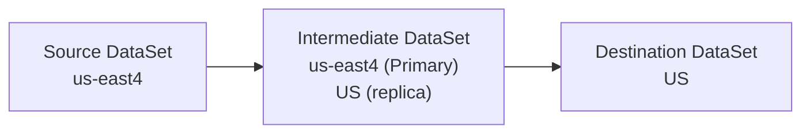
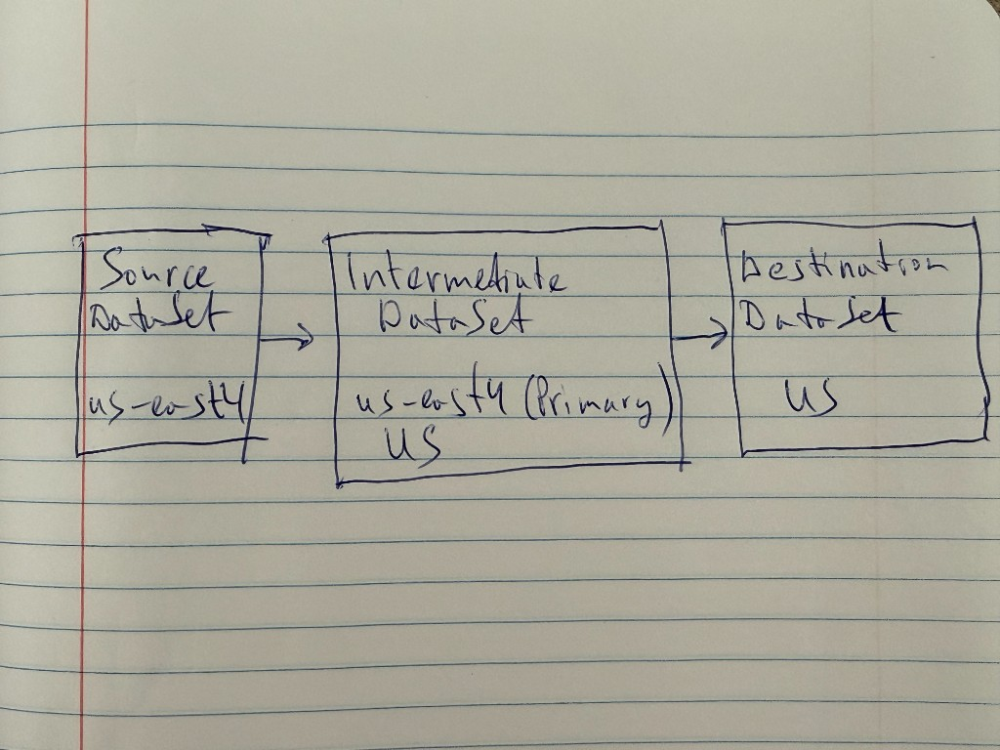
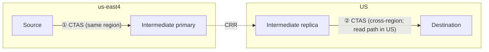

# Cross-region BigQuery test report

Manual tests performed in the Google Cloud Console using datasets and KMS keys provisioned by this repository’s Terraform (`us-east1` sources → `us-east4` destinations). Project: **feelinsosweet**.

## Scenarios

| Source CMEK | Dest CMEK | DTS | CRR | CRR (secondary) |
|-------------|-----------|-----|------|-----------------|
| Yes | Yes | ✅ Pass | ✅ Pass | ❌ Fail |
| Yes | No | ❌ Fail | ✅ Pass | ❌ Fail |
| No | Yes | ❌ Fail | ✅ Pass | ❌ Fail |
| No | No | ✅ Pass | ✅ Pass | ❌ Fail |

- **DTS**: BigQuery Data Transfer Service.
- **CRR**: Cross-region replication when the source-region replica in the destination dataset is the **primary** replica (copying into the destination works in these tests).
- **CRR (secondary)**: Same replication setup, but the source-region replica in the destination dataset is still the **secondary** replica. In that state, **data cannot be copied into the destination dataset** until that replica is promoted to **primary** in the destination dataset.

## Observations

1. **DTS** succeeded only when **source and destination CMEK usage matched** (both CMEK or both non-CMEK). It failed when one side used CMEK and the other did not.
2. **CRR** succeeded in **all four** combinations of source/destination CMEK.
3. **CRR (secondary)** failed in every run: with the source-region replica still **secondary** in the destination dataset, copy/load into the destination was not possible. **Promoting that replica to primary** in the destination dataset is required before those operations can succeed.

4. **Cross-region CTAS** (empirical): for `CREATE TABLE … AS SELECT` across regions to work, the dataset you read from needs a **replica in the region where the destination dataset’s primary lives**.

## CTAS cross-region transfer

**Goal:** Move data from a **us-east4**-only source to a **US**-only destination using CTAS, without relying on DTS for the whole path, so as to avoid the DTS CMEK restrictions.

**Layout (three datasets):**

1. **Source dataset** — region **us-east4** only; **no** cross-region replicas.
2. **Intermediate dataset** — **us-east4** is **primary**; **US** is a **replica** (same logical dataset, two regional footprints).
3. **Destination dataset** — region **US** only; **no** replicas.

**Overview (three datasets, left to right):**

The intermediate dataset is one logical dataset: **primary** in **us-east4** and a **replica** in **US** (cross-region replication between those footprints). Arrows are the intended data movement (CTAS steps detailed below).

Original sketch:

**CTAS sequence (two writes; replication is automatic between them):**

① loads the intermediate **primary** in **us-east4**. After **CRR** materializes the **US** replica, ② runs in **US** so the read side matches the destination dataset’s region and the cross-region CTAS rule in observation 4 holds.

## Reproducibility

Infrastructure definitions: repository root Terraform (`README.md` in parent directory). Transfers and replication were configured and run manually in the Console; this document only records outcomes.
