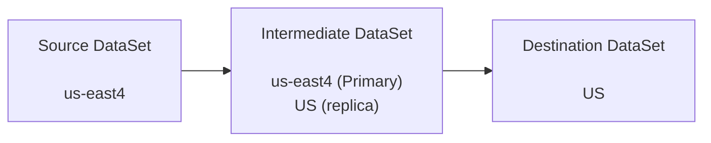
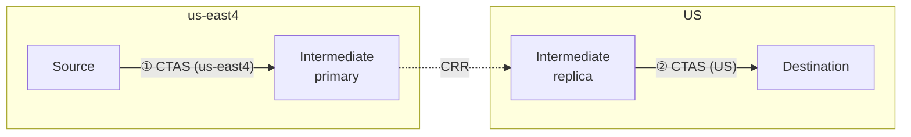

# Cross-region BigQuery test report

Manual tests performed in the Google Cloud Console using datasets and KMS keys provisioned by this repository’s Terraform (**`us-east4`** sources → **`US`** multi-region destinations). Project: **feelinsosweet**.

## Scenarios

| Source CMEK | Dest CMEK | DTS | `bq cp` | CRR | CRR (secondary) |
|-------------|-----------|-----|---------|------|-----------------|
| Yes | Yes | ✅ Pass | ✅ Pass | ✅ Pass | ❌ Fail |
| Yes | No | ❌ Fail | ❌ Fail | ✅ Pass | ❌ Fail |
| No | Yes | ❌ Fail | ❌ Fail | ✅ Pass | ❌ Fail |
| No | No | ✅ Pass | ✅ Pass | ✅ Pass | ❌ Fail |

Cross-region **`bq cp`** (**`us-east4` → `US`**) for `sample_cross_region_test` (project `feelinsosweet`). Example destination IDs use the `from_us_east4*` suffix to distinguish scenarios. **`bq cp`** matches **DTS** on CMEK: Pass when source and destination are both CMEK or both non-CMEK; mixed CMEK fails unless you use **`--destination_kms_key`** or an in-region CMEK staging copy, as BigQuery’s errors describe.

```bash
# Yes / Yes — CMEK → CMEK
bq cp -f \
  feelinsosweet:source_us_east4_cmek.sample_cross_region_test \
  feelinsosweet:dest_us_cmek.from_us_east4_cmek

# Yes / No — CMEK source → non-CMEK dest
bq cp -f \
  feelinsosweet:source_us_east4_cmek.sample_cross_region_test \
  feelinsosweet:dest_us.from_us_east4_cmek

# No / Yes — non-CMEK source → CMEK dest
bq cp -f \
  feelinsosweet:source_us_east4.sample_cross_region_test \
  feelinsosweet:dest_us_cmek.from_us_east4

# No / No — non-CMEK → non-CMEK
bq cp -f \
  feelinsosweet:source_us_east4.sample_cross_region_test \
  feelinsosweet:dest_us.from_us_east4
```

Terraform creates partitioned `sample_cross_region_test` in both **`source_us_east4`** and **`source_us_east4_cmek`** (same query template). The **Yes / Yes** and **Yes / No** `bq cp` commands can run against the CMEK source table directly.

- **DTS**: BigQuery Data Transfer Service.
- **CRR**: Cross-region replication when the source-region replica in the destination dataset is the **primary** replica (copying into the destination works in these tests).
- **CRR (secondary)**: Same replication setup, but the source-region replica in the destination dataset is still the **secondary** replica. In that state, **data cannot be copied into the destination dataset** until that replica is promoted to **primary** in the destination dataset.

## Observations

1. **DTS** succeeded only when **source and destination CMEK usage matched** (both CMEK or both non-CMEK). It failed when one side used CMEK and the other did not.
2. **`bq cp`** (cross-region **`us-east4` → `US`**) follows the **same CMEK pairing rule as DTS**: Pass in the **Yes / Yes** and **No / No** rows; Fail in the mixed rows, with BigQuery errors about CMEK unless you supply a destination key or do an in-region CMEK copy first.
3. **CRR** succeeded in **all four** combinations of source/destination CMEK.
4. **CRR (secondary)** failed in every run: with the source-region replica still **secondary** in the destination dataset, copy/load into the destination was not possible. **Promoting that replica to primary** in the destination dataset is required before those operations can succeed.

5. **Cross-region CTAS** (empirical): for `CREATE TABLE … AS SELECT` across regions to work, the dataset you read from needs a **replica in the region where the destination dataset’s primary lives**.

### Why CRR (secondary) fails: secondary replicas are read-only

For a dataset that uses cross-region replication, only the **primary** replica accepts **writes** (new tables, loads, CTAS that materialize in that dataset, `bq cp` into that dataset, etc.). **Secondary** replicas are **read-only**: reads are fine, but anything that would **write** through the secondary regional footprint is rejected until that replica is promoted to primary.

One check used a dataset with **primary** in **`US`** and a **secondary** replica in **`us-east4`**. A CTAS with `SET @@location='us-east4';` targeting that destination tries to write while the job runs in **`us-east4`**, i.e. against the **secondary** replica. BigQuery returns an error like:

> Invalid value: The dataset replica of the cross region dataset '…' in region 'us-east4' is read-only because it's not the primary replica.

The dataset **Details** UI lists **Secondary** in `us-east4` with **Make it primary**, and **Primary** in **`US`**. Until the replica in the region where you need writes is primary, **CRR (secondary)** stays a failed path for copy/load/CTAS into that destination from that region.

## CTAS cross-region transfer

**Goal:** Move data from a **us-east4**-only source to a **US**-only destination using CTAS, without relying on DTS for the whole path, so as to avoid the DTS CMEK restrictions.

**Layout (three datasets):**

1. **Source dataset** — region **us-east4** only; **no** cross-region replicas.
2. **Intermediate dataset** — **us-east4** is **primary**; **US** is a **replica** (same logical dataset, two regional footprints).
3. **Destination dataset** — region **US** only; **no** replicas.

**Overview (three datasets, left to right):**



The intermediate dataset is one logical dataset: **primary** in **us-east4** and a **replica** in **US** (cross-region replication between those footprints). Arrows are the intended data movement (CTAS steps detailed below).

**CTAS sequence (two writes; replication is automatic between them):**



- ① loads the intermediate **primary** in **us-east4**. After **CRR** materializes the **US** replica.
- ② runs in **US** so the read side matches the destination dataset’s region and the cross-region CTAS rule in observation 5 holds.

## Global queries (alternative to CRR for cross-region CTAS)

[Global queries](https://cloud.google.com/bigquery/docs/global-queries) can drive **cross-region `CREATE TABLE … AS SELECT`** and related work **without** an intermediate dataset and **without** cross-region replication (CRR)—Google routes the job across regions for you.

That path is a poor fit for **large** moves: in the [BigQuery quotas](https://cloud.google.com/bigquery/quotas#copy_jobs), a **single copy job** that is part of a global query cannot move more than **100 GB**. That limit applies to **that** global-query flow; it is **not** the same as saying every `bq cp` or every table copy is capped at 100 GB, but it is the clearest **per-job byte** cap tied to copy-style work in the quota table. Above that size, patterns like the CRR + CTAS layout above, **chunked** queries, or **export / load** remain more realistic.

## Reproducibility

Infrastructure definitions: repository root Terraform (`README.md` in parent directory). Transfers and replication were configured and run manually in the Console; this document only records outcomes.
